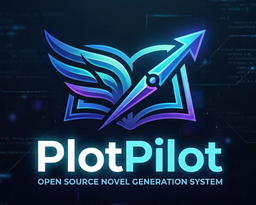

# PlotPilot（墨枢）

<p align="center">
  
</p>

> AI 驱动的长篇创作平台 — 自动驾驶生成、知识图谱管理、风格分析一体化。

[](https://www.python.org/)
[](https://vuejs.org/)
[](https://fastapi.tiangolo.com/)
[](LICENSE)

- **顶层架构**：上下文管理、知识体系、消费组件、状态感知等，超过 20 余个 prompt 接点，支持定制。
- **通用设计**：通过提示词定制，支持短篇小说、超长篇小说、剧本、标书、转录等多种任务类型。
- **自动驾驶模式**：后台守护进程持续生成章节，支持 SSE 实时流式推送。
- **Story Bible**：人物、地点、世界设定的结构化管理。
- **知识图谱**：自动提取故事三元组，语义检索历史内容。
- **伏笔台账**：追踪并自动闭合叙事钩子。
- **风格分析**：作者声音漂移检测与文体指纹。
- **节拍表与故事结构**：三幕式、章节节拍规划。
- **DDD 四层架构**：`domain` / `application` / `infrastructure` / `interfaces`

---

## 产品亮点

**全托管自动驾驶**：后台守护进程按阶段推进 **宏观规划 → 幕级节拍 → 章节生成 → 章末审阅**，无需逐章手动触发，可持续写满目标字数；支持 **熔断保护**、**人工审阅节点**、**SSE 实时状态推流**。

**统一章后管线**：章末 **一次 LLM 调用**完成摘要提取、关键事件、人物三元组、伏笔注册与消费检测、故事线进展，落库并建立 **本地向量索引**。**HTTP 手动保存**与**自动驾驶**共用同一套管线（叙事落库 + 索引），逻辑不漂移。

**多层记忆与监控**：**Story Bible**（人物、地点、世界设定）、分章摘要、向量语义检索、伏笔台账、叙事事件与时间轴多路注入上下文；**章节张力**（0–10）与历史张力曲线、**文风相似度与漂移告警**，偏离时 **定向修写**、不回滚章节。

**提示词与工作台**：集中式配置 **20+ 提示接点**，声线锚点、节拍约束、字数层级、记忆引擎铁律等可独立策略化，适配短篇、超长篇、剧本、标书等。**工作台**整合写作区与实时预览、章节状态与审阅、张力心电图、伏笔与知识图谱、监控大盘、LLM 控制台。

---

## 一键启动（Windows）

项目提供开箱即用的图形化启动器，**无需提前安装 Python、无需命令行**：

1. 将 `python-3.11.9-embed-amd64.zip` 放入 `tools/` 目录（首次使用）
2. 双击 `tools/aitext.bat`

启动器将自动完成：环境自检 → 创建虚拟环境 → 安装依赖（国内镜像源自动切换）→ 启动后端服务 → 打开浏览器。后续启动直接双击即可。

> 也支持 `aitext.bat pack` 打包整个项目分享给他人，对方双击即用。

---

## 桌面安装版（Windows · Tauri）

- **全部发行版**：[GitHub Releases](https://github.com/shenminglinyi/PlotPilot/releases)
- **说明**：安装包内含冻结后端，无需单独装 Python；构建流程见 [docs/BUILD_INSTALLER.md](docs/BUILD_INSTALLER.md)。

---

## 开发者启动

**环境要求**：Python 3.9+、Node.js 18+

```bash
# 后端
python -m venv .venv && .venv\Scripts\activate
pip install -r requirements.txt
copy .env.example .env    # 填写 LLM 凭证
uvicorn interfaces.main:app --host 127.0.0.1 --port 8005 --reload

# 前端（另开终端）
cd frontend && npm install && npm run dev
```

后端 API：`http://127.0.0.1:8005` · 文档：`http://127.0.0.1:8005/docs` · 前端：`http://localhost:3000`

生产构建后前端可由 FastAPI 静态托管（`frontend/dist`），也可独立部署。

---

## 技术栈


| 层     | 技术                                                                      |
| ----- | ----------------------------------------------------------------------- |
| 后端框架  | FastAPI + uvicorn，DDD 四层架构                                              |
| AI 模型 | OpenAI 兼容协议 / Anthropic Claude / 火山方舟 Doubao                            |
| 向量存储  | 本地 FAISS（无需额外服务）                                                        |
| 嵌入模型  | OpenAI 兼容 API（默认）/ 本地 sentence-transformers（见 `requirements-local.txt`） |
| 主数据库  | SQLite                                                                  |
| 前端    | Vue 3 + TypeScript + Vite + Naive UI + ECharts                          |


---

## 环境变量


| 变量                                  | 说明                               |
| ----------------------------------- | -------------------------------- |
| `ANTHROPIC_API_KEY` / `ARK_API_KEY` | 至少配置一个 LLM 凭证                    |
| `EMBEDDING_SERVICE`                 | `openai`（默认）或 `local`（本地需额外安装模型） |
| `CORS_ORIGINS`                      | 生产环境前端域名，逗号分隔                    |
| `DISABLE_AUTO_DAEMON`               | 设为 `1` 禁止启动时自动拉起守护进程             |
| `LOG_LEVEL` / `LOG_FILE`            | 日志级别与路径                          |


完整说明见 `.env.example`。

---

## 测试

```bash
pytest tests/ -v
```

如需覆盖率：`pytest tests/ --cov=. --cov-report=term-missing`

---

## 贡献

1. Fork 本仓库
2. 新建分支：`git checkout -b feat/your-feature`
3. 提交说明建议遵循 [Conventional Commits](https://www.conventionalcommits.org/)
4. 推送并发起 Pull Request

---

## 交流与实战演示

纸上得来终觉浅。如果你想看这套系统在实际创作里怎么跑，欢迎来直播间蹲点：

- **抖音**：搜索直播间 **91472902104** 即可找到  
- **时间**：每晚约 **21:00** 随缘开播（以实际为准）  
- **内容**：现场写脑洞、改 Bug、看 PR，以及本地部署相关的常见问题

欢迎创作者和技术同行来直播间交流。

---

## 许可证

本项目采用 **Apache License 2.0**，并附加 **Commons Clause** 条件限制。

允许学习、修改与非商业内部部署；**严禁**将本项目（含修改版）用于任何营利行为，包括封装收费 SaaS、打包售卖源码或作为收费产品的增值服务。详见 [LICENSE](LICENSE)。

---

## Star History

<a href="https://www.star-history.com/?repos=shenminglinyi%2FPlotPilot&type=date&legend=top-left">
 <picture>
   <source media="(prefers-color-scheme: dark)" srcset="https://api.star-history.com/chart?repos=shenminglinyi/PlotPilot&type=date&theme=dark&legend=top-left" />
   <source media="(prefers-color-scheme: light)" srcset="https://api.star-history.com/chart?repos=shenminglinyi/PlotPilot&type=date&legend=top-left" />
   
 </picture>
</a>
